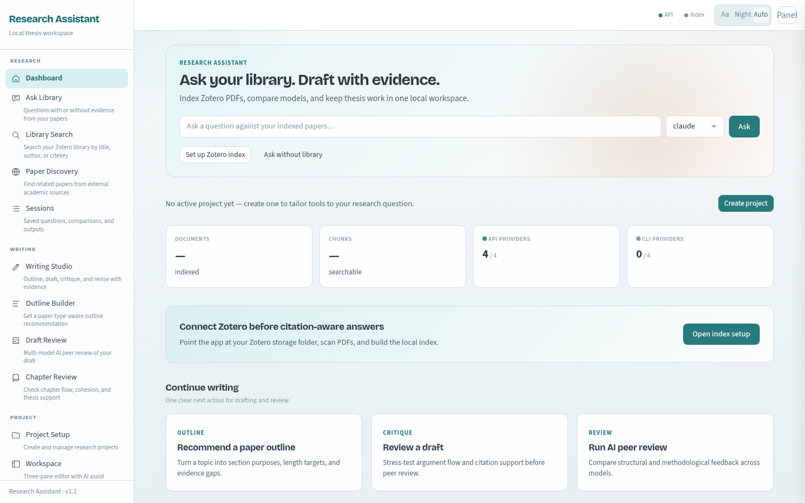
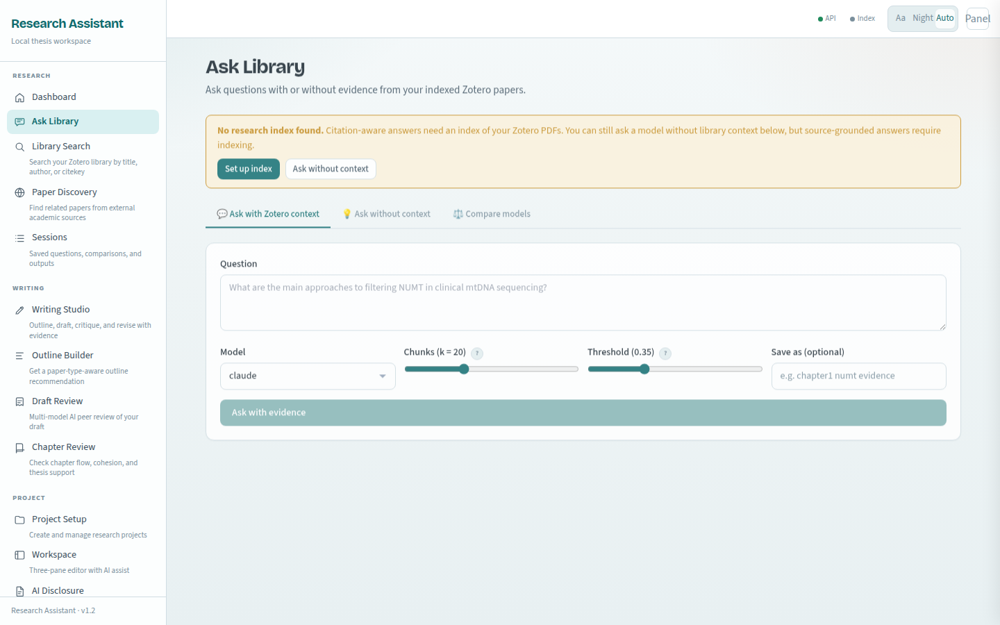
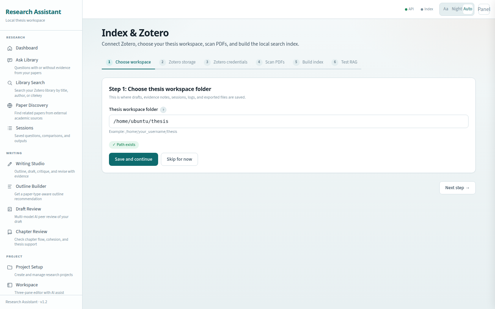
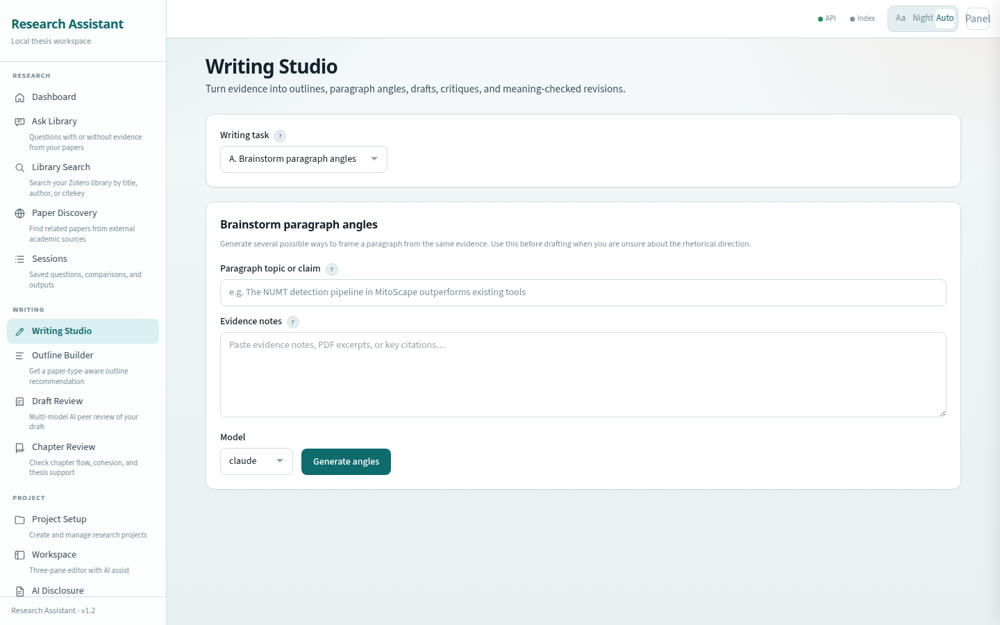
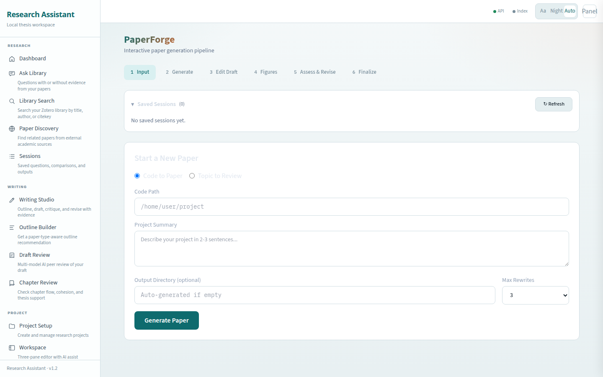

# Research Assistant

[](https://www.python.org/)
[](LICENSE)
[](https://flask.palletsprojects.com/)
[](https://www.zotero.org/)

A local-first workspace for thesis writing and literature review.

Index your Zotero PDFs, ask cited questions over your own library, compare models, draft with evidence, and keep AI usage logs for disclosure — all on your machine.

## Live demo

This app runs locally in your browser after setup. Here is what the Web UI looks like:

<p align="center">
  
</p>

<p align="center"><em>Dashboard — ask your library from one place</em></p>

<p align="center">
  
</p>

<p align="center"><em>Ask Library — citation-aware Q&amp;A over indexed papers</em></p>

<p align="center">
  
</p>

<p align="center"><em>Index setup — connect Zotero and build a local search index</em></p>

<details>
<summary>More screenshots</summary>

<p align="center">
  
</p>
<p align="center"><em>Writing Studio</em></p>

<p align="center">
  
</p>
<p align="center"><em>PaperForge — multi-agent paper drafting</em></p>

</details>

### Try it locally

```bash
git clone https://github.com/femrebora/research-assistant.git
cd research-assistant
bash scripts/setup.sh
bash scripts/install_cli.sh
source ~/.bashrc
ra
```

Open [http://127.0.0.1:5050](http://127.0.0.1:5050) if the browser does not open on its own.

| Command   | What it does              |
| --------- | ------------------------- |
| `ra`      | Start or reopen the app   |
| `ra stop` | Stop the background server |
| `ra doctor` | Check common setup issues |

## What you can do

| Feature | What it does |
| ------- | ------------ |
| **Zotero RAG** | Index local Zotero PDFs and retrieve relevant chunks |
| **Ask Library** | Ask cited questions, ask without context, or compare models |
| **Paper Discovery** | Search OpenAlex, Semantic Scholar, and Elicit |
| **Writing Studio** | Outline, draft, critique, paraphrase, and check coherence |
| **Projects & Workspace** | Keep each thesis or manuscript organized |
| **Claim Verification** | Check whether draft claims match retrieved evidence |
| **PaperForge** | Multi-agent workflow for academic paper drafts |
| **AI Disclosure** | Save model usage logs and generate disclosure text |

## Requirements

- Python 3.11+
- A bash-compatible shell
- Zotero (recommended for citation-aware work)
- At least one model provider (API key, Ollama, or CLI tool)

You do not need every API key. One working provider is enough to start.

## First-run checklist

After opening the Web UI:

1. **Settings** (`/settings`) — add at least one API key or CLI provider
2. **Providers** (`/providers`) — test the models you want to use
3. **Settings** — confirm `THESIS_ROOT` and `ZOTERO_STORAGE`
4. **Index setup** (`/index-setup`) — scan and index your Zotero PDFs
5. **Projects** (`/projects`) — create your thesis or manuscript project
6. **Ask Library** (`/ask-library`) — ask a small test question

## Configure providers

Add keys in `.env` or from `/settings`:

```bash
ANTHROPIC_API_KEY=sk-ant-your-key
GEMINI_API_KEY=your-gemini-key
DEEPSEEK_API_KEY=sk-your-deepseek-key
OPENAI_API_KEY=sk-your-openai-key
```

Then restart:

```bash
ra restart
```

Optional local models with Ollama:

```bash
ollama pull llama3.3
OLLAMA_MODEL=ollama/llama3.3
```

## Configure Zotero

```bash
ZOTERO_STORAGE=/home/yourname/Zotero/storage
ZOTERO_USER_ID=1234567
ZOTERO_API_KEY=your-zotero-api-key
```

Get your user ID and API key at [zotero.org/settings/keys](https://www.zotero.org/settings/keys).

`ZOTERO_STORAGE` must point to the folder that contains attachment subfolders (for example `~/Zotero/storage`), not a single paper folder.

Then open `/index-setup` and run the scan and indexing steps.

## Where your work is saved

Default workspace: `~/thesis`

| Output | Location |
| ------ | -------- |
| Drafts, notes, evidence | `~/thesis/projects/<project>/` |
| Research sessions | `~/thesis/research_sessions/` |
| Vector index | `~/thesis/chroma_db/` |
| AI usage logs | `~/thesis/logs/` |
| App settings | `./.env` in the repo |
| Server log | `~/.local/share/research-assistant/research-assistant.log` |

## Useful commands

```bash
# App control
ra
ra stop
research-assistant restart
research-assistant doctor

# Research
ra-researcher ask "What are the main mechanisms of TRAIL resistance?"
ra-researcher index
ra-compare "Compare these mechanisms across models"
ra-discover "metabolic rewiring glioblastoma" --source openalex

# Writing
ra-outline-recommender
ra-critique draft.md
ra-claim-verify draft.md
ra-disclose
```

Or with npm:

```bash
npm run setup && npm run start
npm run doctor
npm run test
```

## Privacy and academic use

- Your drafts, indexes, sessions, and logs stay local by default.
- API model calls may send prompts to external providers.
- Verify claims against original papers before using generated text.
- Follow your institution’s AI disclosure rules.
- Never commit `.env`, private drafts, or unpublished manuscripts.

## Updating

```bash
git pull
bash scripts/setup.sh
bash scripts/install_cli.sh
ra restart
```

## More docs

- [docs/USAGE.md](docs/USAGE.md) — daily workflow and troubleshooting
- [docs/FAQ.md](docs/FAQ.md) — common questions
- [docs/ARCHITECTURE.md](docs/ARCHITECTURE.md) — how the project is organized
- [CONTRIBUTING.md](CONTRIBUTING.md) — how to contribute

## License

MIT. See [LICENSE](LICENSE).
